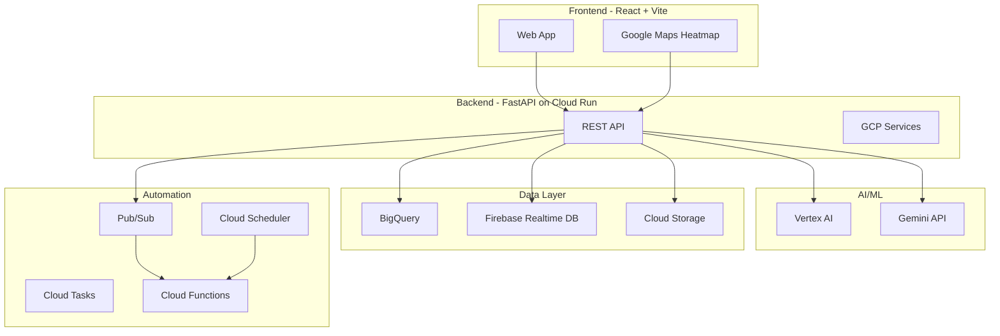
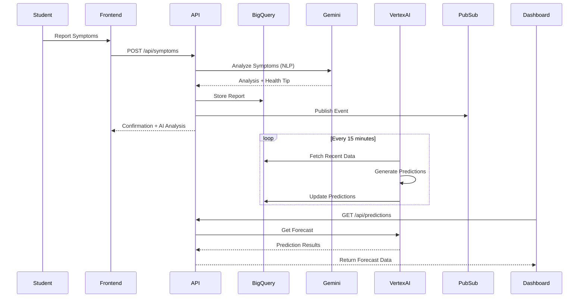

# FEVER ORACLE

**AI-Powered Campus Disease Outbreak Prediction System**

FEVER ORACLE uses 15 Google Cloud technologies to predict and prevent disease outbreaks on campus through anonymous symptom reporting, real-time analytics, and AI-powered predictions.

---

## Features

- **Anonymous Symptom Reporting** - No personal data collected
- **Real-time Dashboard** - Live campus health monitoring
- **AI Predictions** - Vertex AI outbreak forecasting
- **Google Maps Heatmap** - Visual symptom clusters
- **Automated Alerts** - Gemini-generated notifications
- **BigQuery Analytics** - Comprehensive data warehouse

---

## Google Cloud Technologies

| #   | Technology               | Purpose                        |
| --- | ------------------------ | ------------------------------ |
| 1   | **Vertex AI**            | ML model training & deployment |
| 2   | **Gemini API**           | Natural language processing    |
| 3   | **BigQuery**             | Data warehouse & analytics     |
| 4   | **Cloud Run**            | Serverless backend             |
| 5   | **Firebase Realtime DB** | Mobile data sync               |
| 6   | **Cloud Pub/Sub**        | Real-time messaging            |
| 7   | **Cloud Storage**        | HIPAA data archival            |
| 8   | **Cloud Dataflow**       | ETL data processing            |
| 9   | **Data Studio**          | Dashboards & visualization     |
| 10  | **Google Maps**          | Geospatial analysis            |
| 11  | **Cloud Tasks**          | Alert scheduling               |
| 12  | **Cloud Scheduler**      | Cron jobs                      |
| 13  | **Cloud Functions**      | Lightweight functions          |
| 14  | **Cloud Logging**        | System logs                    |
| 15  | **Cloud Monitoring**     | Performance metrics            |

---

## Architecture



### Data Flow



---

## Project Structure

```
├── frontend/                  # React + TypeScript + Vite
│   ├── src/
│   │   ├── components/        # UI components
│   │   ├── pages/             # Page components
│   │   └── lib/               # Firebase, API utilities
│   └── .env.example           # Environment template
├── backend/                   # FastAPI Python server
│   ├── main.py                # API with GCP integration
│   ├── services/              # GCP service modules
│   │   ├── vertex_ai.py       # ML predictions
│   │   ├── gemini.py          # NLP analysis
│   │   ├── bigquery.py        # Data warehouse
│   │   ├── pubsub.py          # Messaging
│   │   ├── storage.py         # Cloud Storage
│   │   ├── firebase_db.py     # Realtime DB
│   │   ├── cloud_tasks.py     # Task queue
│   │   ├── cloud_logging.py   # Logging
│   │   └── cloud_monitoring.py # Metrics
│   ├── Dockerfile             # Cloud Run container
│   └── requirements.txt       # Python dependencies
├── functions/                 # Cloud Functions
│   └── main.py                # Event handlers
├── scheduler/                 # Cloud Scheduler
│   └── jobs.yaml              # Cron job definitions
├── cloudbuild.yaml            # CI/CD pipeline
└── firebase.json              # Firebase hosting config
```

---

## Getting Started

### Prerequisites

- Node.js 18+
- Python 3.11+
- Google Cloud SDK
- Firebase CLI

### 1. Clone & Install

```bash
# Frontend
cd frontend
cp .env.example .env.local
# Edit .env.local with your Firebase config
npm install

# Backend
cd backend
python3 -m venv venv
source venv/bin/activate
pip install -r requirements.txt
```

### 2. Configure Environment

**Frontend** (`.env.local`):

```env
VITE_API_URL=http://localhost:8000
VITE_FIREBASE_API_KEY=your_key
VITE_FIREBASE_PROJECT_ID=your_project
VITE_GOOGLE_MAPS_API_KEY=your_maps_key
```

**Backend** (`.env`):

```env
GOOGLE_CLOUD_PROJECT=your_project_id
GEMINI_API_KEY=your_gemini_key
```

### 3. Run Locally

```bash
# Terminal 1: Backend
cd backend && python main.py

# Terminal 2: Frontend
cd frontend && npm run dev
```

- Frontend: http://localhost:8080
- Backend: http://localhost:8000

---

## Deployment

### Backend (Cloud Run)

```bash
gcloud builds submit --config cloudbuild.yaml
```

### Frontend (Firebase Hosting)

```bash
cd frontend
npm run build
firebase deploy
```

### Cloud Functions

```bash
cd functions
gcloud functions deploy on_symptom_report \
  --runtime python311 \
  --trigger-topic symptom-reports
```

---

## API Endpoints

| Method | Endpoint           | Description                  |
| ------ | ------------------ | ---------------------------- |
| GET    | `/`                | API info + GCP services list |
| GET    | `/api/health`      | Health check                 |
| POST   | `/api/symptoms`    | Submit report (AI analysis)  |
| GET    | `/api/stats`       | Dashboard statistics         |
| GET    | `/api/alerts`      | Gemini-generated alerts      |
| GET    | `/api/heatmap`     | Campus zone data             |
| GET    | `/api/predictions` | Vertex AI forecast           |

### Example Request

```bash
curl -X POST http://localhost:8000/api/symptoms \
  -H "Content-Type: application/json" \
  -d '{
    "location": "North Dorms",
    "symptoms": ["fever", "cough"],
    "severity": "moderate"
  }'
```

### Response (with AI Analysis)

```json
{
  "success": true,
  "report_id": "RPT-000001",
  "health_tip": "Stay hydrated and get plenty of rest.",
  "analysis": {
    "likely_conditions": ["Common cold", "Seasonal flu"],
    "risk_assessment": "moderate",
    "recommendation": "Monitor symptoms and visit health center if they worsen.",
    "should_seek_care": false
  }
}
```

---

## License

MIT License

---

## Contributing

1. Fork the repository
2. Create a feature branch
3. Commit changes
4. Push and open a Pull Request
